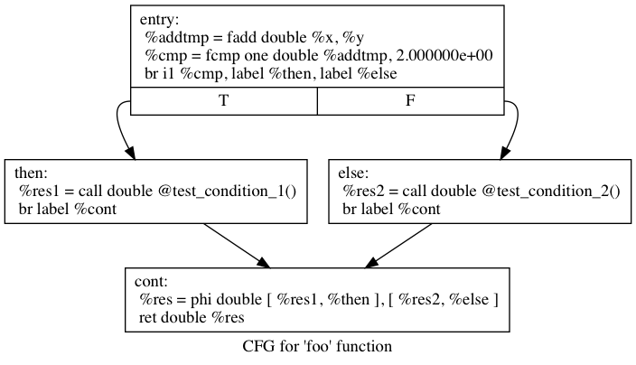
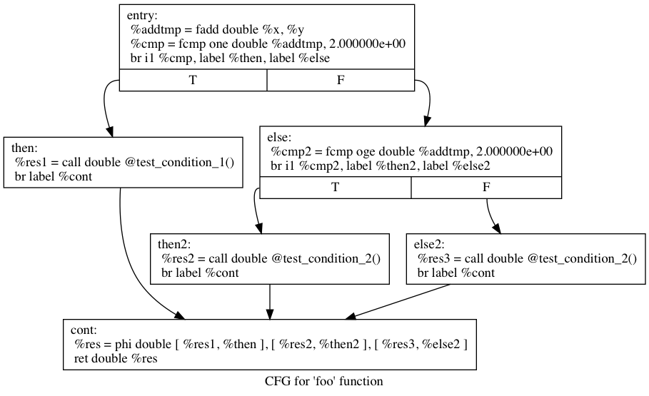

# LLVM and Toy language

## Playing around LLVM

```
# emit LLVM
$ clang file.c -fomit-frame-pointer -S -emit-llvm -o -

# emit optimized assembly
$ clang file.c -fomit-frame-pointer -O3 -S -o -

# emit non-optimized assembly
$ clang file.c -fomit-frame-pointer -S -emit-llvm -o -

# compile with clang 
$ clang file.c 
--> outputs a.out

# run the program
$ ./a.out 10 foo bar
my num of args are: 4
and they are...
0: ./a.out
1: 10
2: foo
3: bar
nhaaaaaaaaaaaaa huuuuuuuuuuu: 10
nhaaaaaaaaaaaaa huuuuuuuuuuu: 9
nhaaaaaaaaaaaaa huuuuuuuuuuu: 8
nhaaaaaaaaaaaaa huuuuuuuuuuu: 7
nhaaaaaaaaaaaaa huuuuuuuuuuu: 6
nhaaaaaaaaaaaaa huuuuuuuuuuu: 5
nhaaaaaaaaaaaaa huuuuuuuuuuu: 4
nhaaaaaaaaaaaaa huuuuuuuuuuu: 3
nhaaaaaaaaaaaaa huuuuuuuuuuu: 2
nhaaaaaaaaaaaaa huuuuuuuuuuu: 1
```


## Testing toy language

### Chapters 2 and 3 (Parser)

```
# Compile and Run
$ clang++ -g -O3 toy.cpp `llvm-config --cxxflags --ldflags --system-libs --libs core` -o toy.app && ./toy.app

# Now test the parsing of 'def bar(a b c d e f g h) a + b + (c + d) * g * f + h;'
ready> def bar(a b c d e f g h) a + b + (c + d) * g * f + h;
ready> Parsed a function definition.
ready>
ready> def foo(a,b) ret a + b;
ready> Read function definition:
define double @foo(double %a, double %b) {
entry:
  %addtmp = fadd double %a, %b
  ret double %addtmp
}

ready> foo(3.2,0.5);
ready> Read top-level expression:
define double @__anon_expr() {
entry:
  %calltmp = call double @foo(double 3.200000e+00, double 5.000000e-01)
}

ready> 3.2+1.1;
Read top-level expression:
define double @__anon_expr() {
entry:
  %calltmp = call double @foo(double 3.200000e+00, double 5.000000e-01)

entry1:                                           ; No predecessors!
}
```

### Chapter 4 (JIT)

```
$ clang++ -g -O3 toy-4.cpp `llvm-config --cxxflags --ldflags --system-libs --libs core mcjit native` -I ../llvm/examples/Kaleidoscope/include/ -o toy-4.app && ./toy-4.app

ready> def foo(x,y) ret x+y;
ready> def bar(x,y) x+y;
ready>foo(123,321);
Evaluated tp 444.000000
ready>bar(123,321);
Evaluated tp 444.000000
ready> ^C
```

### Chapter 5 (JIT)

```
$ clang++ -g -O3 toy-5.cpp `llvm-config --cxxflags --ldflags --system-libs --libs core mcjit native` -I ../llvm/examples/Kaleidoscope/include/ -o toy-5.app && ./toy-5.app
```

### Chapter 6 (User defined Operators)

```
$ clang++ -g -O3 toy-6.cpp `llvm-config --cxxflags --ldflags --system-libs --libs core mcjit native` -I ../llvm/examples/Kaleidoscope/include/ -o toy-6.app && ./toy-6.app

ready>
# Logical unary not.
def unary!(v)
  if v then
    0
  else
    1;

# Unary negate.
def unary-(v)
  0-v;

# Define > with the same precedence as <.
def binary> 10 (LHS RHS)
  RHS < LHS;

# Binary logical or, which does not short circuit.
def binary| 5 (LHS RHS)
  if LHS then
    1
  else if RHS then
    1
  else
    0;

# Binary logical and, which does not short circuit.
def binary& 6 (LHS RHS)
  if !LHS then
    0
  else
    !!RHS;

# Define = with slightly lower precedence than relationals.
def binary = 9 (LHS RHS)
  !(LHS < RHS | LHS > RHS);

# Define ':' for sequencing: as a low-precedence operator that ignores operands
# and just returns the RHS.
def binary : 1 (x y) y;

# define putchard
extern putchard(char);

ready> def sayMyName() 
putchard(84): putchard(104): putchard(105): putchard(97):putchard(103):putchard(111):
putchard(32):
putchard(65): putchard(110): putchard(100): putchard(114):putchard(97):putchard(100):putchard(101):
putchard(10)
;

ready> sayMyName();
Thiago Andrade

ready> sayMyName():sayMyName():sayMyName();
Thiago Andrade
Thiago Andrade
Thiago Andrade
```

### Chapter 7 (User defined variables)

```
$ clang++ -g -O3 toy-7.cpp `llvm-config --cxxflags --ldflags --system-libs --libs core mcjit native` -I ../llvm/examples/Kaleidoscope/include/ -o toy-7.app && ./toy-7.app
```

## Debugging toy-4 with LLDB

If for some reason you need to debug toy-4 you can always use [LLDB](https://lldb.llvm.org/lldb-gdb.html)

```
# Starting the debugger
$ lldb toy-4.app
(lldb) target create "toy-4.app"
Current executable set to 'toy-4.app' (x86_64).

# Listing the breakpoints
(lldb) b
No breakpoints currently set.

# Creating a breakpoint
(lldb) b toy-4.cpp:368
Breakpoint 1: where = toy-4.app`ParseExpression() + 16 at toy-4.cpp:371, address = 0x0000000100004a20

# Run the application
(lldb) run
Process 60041 launched: '/Users/thiagoh/dev/llvm-src/llvm-initial-tests/toy-4.app' (x86_64)
ready> def foo(x,y) ret x+y+y;
ready> toy-4.app was compiled with optimization - stepping may behave oddly; variables may not be available.
Process 60041 stopped
* thread #1: tid = 0x288f1b, 0x0000000100004a20 toy-4.app`ParseExpression() + 16 at toy-4.cpp:371, queue = 'com.apple.main-thread', stop reason = breakpoint 1.1
    frame #0: 0x0000000100004a20 toy-4.app`ParseExpression() + 16 at toy-4.cpp:371 [opt]
   368    std::unique_ptr<ExprAST> LHS;
   369
   370    // @EDITED by Thiago
-> 371    if (CurTok == tok_return) {
   372
   373      getNextToken();
   374

# Go to next Step
(lldb) n
Process 60041 stopped
* thread #1: tid = 0x288f1b, 0x0000000100004a2b toy-4.app`ParseExpression() + 27 at toy-4.cpp:373, queue = 'com.apple.main-thread', stop reason = step over
    frame #0: 0x0000000100004a2b toy-4.app`ParseExpression() + 27 at toy-4.cpp:373 [opt]
   370    // @EDITED by Thiago
   371    if (CurTok == tok_return) {
   372
-> 373      getNextToken();
   374
   375  #ifdef LLVM_IR_DEBUG_PRINT
   376      fprintf(stderr, "ParseExpression and it is a Return : %d %s\n", CurTok,

# Go to next Step   
(lldb) n
Process 60041 stopped
* thread #1: tid = 0x288f1b, 0x0000000100004a38 toy-4.app`ParseExpression() + 40 at toy-4.cpp:376, queue = 'com.apple.main-thread', stop reason = step over
    frame #0: 0x0000000100004a38 toy-4.app`ParseExpression() + 40 at toy-4.cpp:376 [opt]
   373      getNextToken();
   374
   375  #ifdef LLVM_IR_DEBUG_PRINT
-> 376      fprintf(stderr, "ParseExpression and it is a Return : %d %s\n", CurTok,
   377              IdentifierStr.c_str());
   378  #endif
   379

# Resume the application
(lldb) c
Process 60041 resuming
ParseExpression and it is a Return : -5 x
Process 60041 stopped
* thread #1: tid = 0x288f1b, 0x0000000100004a20 toy-4.app`ParseExpression() + 16 at toy-4.cpp:371, queue = 'com.apple.main-thread', stop reason = breakpoint 1.1
    frame #0: 0x0000000100004a20 toy-4.app`ParseExpression() + 16 at toy-4.cpp:371 [opt]
   368    std::unique_ptr<ExprAST> LHS;
   369
   370    // @EDITED by Thiago
-> 371    if (CurTok == tok_return) {
   372
   373      getNextToken();
   374

# Resume the application
(lldb) c
Process 60041 resuming
ParseExpression but not a Return : -5 x
Read function definition:
define double @foo(double %x, double %y) {
entry:
  %addtmp = fadd double %x, %y
  %addtmp1 = fadd double %y, %addtmp
  ret double %addtmp1
}

ready>^C
ready> Process 60041 stopped
* thread #1: tid = 0x288f1b, 0x00007fffc30dfe5a libsystem_kernel.dylib`__read_nocancel + 10, stop reason = signal SIGSTOP
    frame #0: 0x00007fffc30dfe5a libsystem_kernel.dylib`__read_nocancel + 10
libsystem_kernel.dylib`__read_nocancel:
->  0x7fffc30dfe5a <+10>: jae    0x7fffc30dfe64            ; <+20>
    0x7fffc30dfe5c <+12>: movq   %rax, %rdi
    0x7fffc30dfe5f <+15>: jmp    0x7fffc30d8cdf            ; cerror_nocancel
    0x7fffc30dfe64 <+20>: retq
    
# Quit LLDB
(lldb) quit
Quitting LLDB will kill one or more processes. Do you really want to proceed: [Y/n] y
```

## Generating Graphs with Graphviz

```
; LLVM IR code
;
; define double @foo(double %x, double %y) {
; entry:
;   %addtmp = fadd double %x, %y
;   %cmp = fcmp one double %addtmp, 2.0
;   br i1 %cmp, label %then, label %else
; 
;   then:
;     %res1 = call double @test_condition_1()
;     br label %cont
; 
;   else:
;     %res2 = call double @test_condition_2()
;     br label %cont
;   
;   cont:
;     %res = phi double [ %res1, %then ], [ %res2, %else ]
;     ret double %res
; }
; 
; define double @test_condition_1() {
; entry:
;   ret double 123.0
; }
; 
; define double @test_condition_2() {
; entry:
;   ret double 321.0
; }
;
;;; To generate the graph run the command below
;
$ llvm-as < toy-4-sample-output.ll | opt -analyze -view-cfg
```

</img>

```
; LLVM IR code
;
; To generate the graph run the command below
; llvm-as < toy-4-sample-output.ll | opt -analyze -view-cfg
; 
; define double @foo(double %x, double %y) {
; entry:
;   %addtmp = fadd double %x, %y
;   %cmp = fcmp one double %addtmp, 2.0
;   br i1 %cmp, label %then, label %else
; 
;   then:
;     %res1 = call double @test_condition_1()
;     br label %cont
; 
;   else:
;     %cmp2 = fcmp oge double %addtmp, 2.0
;     br i1 %cmp2, label %then2, label %else2
; 
;     then2:
;       %res2 = call double @test_condition_2()
;       br label %cont
;     else2:
;       %res3 = call double @test_condition_2()
;       br label %cont
;   
;   cont:
;     %res = phi double [ %res1, %then ], [ %res2, %then2 ], [ %res3, %else2 ]
;     ret double %res
; }
; 
; define double @test_condition_1() {
; entry:
;   ret double 123.0
; }
; 
; define double @test_condition_2() {
; entry:
;   ret double 321.0
; }
; 
; define double @test_condition_3() {
; entry:
;   ret double 987.0
; }
;
;;; To generate the graph run the command below
;
$ llvm-as < toy-4-sample-output-2.ll | opt -analyze -view-cfg
```

</img>

## How to find out the way LLVM writes IR code

#### 1. First create a code that you want to find out what is the equivalent IR 

Create a code file. For example `loop-test.cpp`

```
// File loop-test.cpp
#include <cstdio>
#include <cstdlib>

/// putchard - putchar that takes a double and returns 0.
extern "C" double putchard(double X) {
  fputc((char)X, stderr);
  return 0;
}

int main() {
  // prints from 'a' to 'z'
  for (float i = 97.0; i < 97.0 + 26; i++) {
    putchard(i);
  }

  return 0;
}
```

#### 2. Emit the LLVM

##### Generating the IR code `.ll` file

```
clang++ -S -emit-llvm loop-test.cpp -o loop-test.ll 
```

##### Generating the OPTIMIZED (mem2reg in this case) IR code `.ll` file

```
clang++ -S -emit-llvm loop-test.cpp -o loop-test-optimized.ll && llvm-as < loop-test-optimized.ll | opt -mem2reg | llvm-dis -o loop-test-optimized.ll
```

Or 

```
// Add mem2reg optimizer directly in your code
TheFPM->add(createPromoteMemoryToRegisterPass());
```

##### The difference between the regular and the optimized

- Regular - stack operations (cycles of `alloca -> store -> load`)
```
...
for.cond:                                         ; preds = %for.inc, %entry
  %0 = load float, float* %i, align 4
  %conv = fpext float %0 to double
  %cmp = fcmp olt double %conv, 1.230000e+02
  br i1 %cmp, label %for.body, label %for.end

for.body:                                         ; preds = %for.cond
  %1 = load float, float* %i, align 4
  %conv1 = fpext float %1 to double
  %call = call double @putchard(double %conv1)
  br label %for.inc
...
```

- Optimized - phi node operations

```
...
for.cond:                                         ; preds = %for.inc, %entry
  %i.0 = phi float [ 9.700000e+01, %entry ], [ %inc, %for.inc ]
  %conv = fpext float %i.0 to double
  %cmp = fcmp olt double %conv, 1.230000e+02
  br i1 %cmp, label %for.body, label %for.end

for.body:                                         ; preds = %for.cond
  %conv1 = fpext float %i.0 to double
  %call = call double @putchard(double %conv1)
  br label %for.inc
...
```

#### 3. Run your test to check if everything's define 

```
clang++ -g loop-test.cpp -o loop-test.app && ./loop-test.app
```

## How to convert IR code to assembler code then to executable

#### 1. Supose you have an LLVM IR file `classes-test.ll` 

```
$ llc -o classes-test.s classes-test.ll
$ g++ classes-test.s -o classes-test.bin
```

#### 2. Then execute it

```
$ ./classes-test.bin
34
3.200000
```